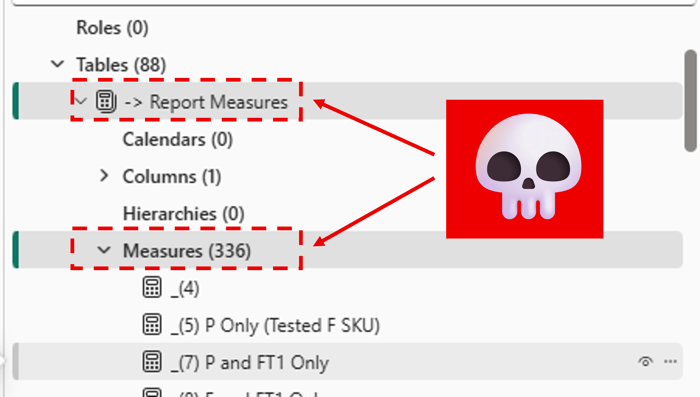
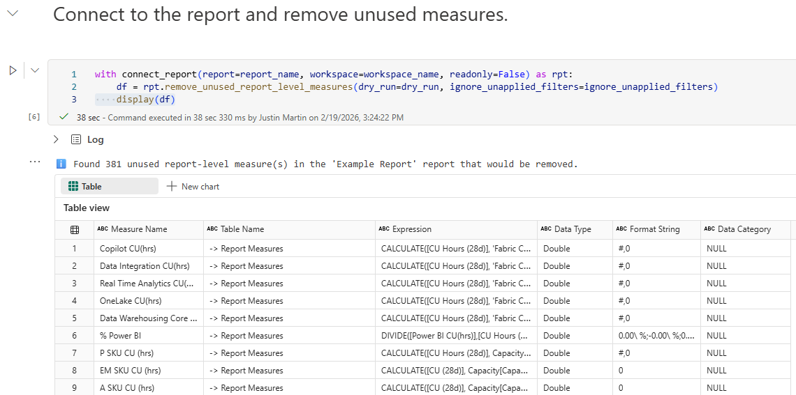
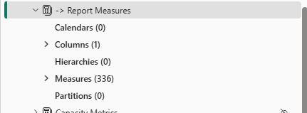
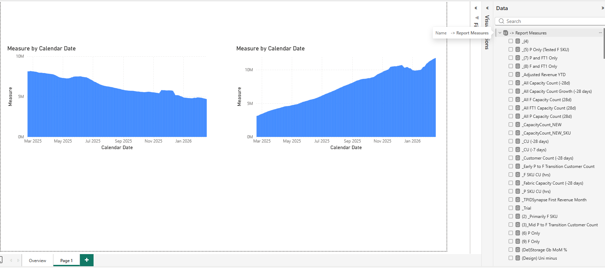
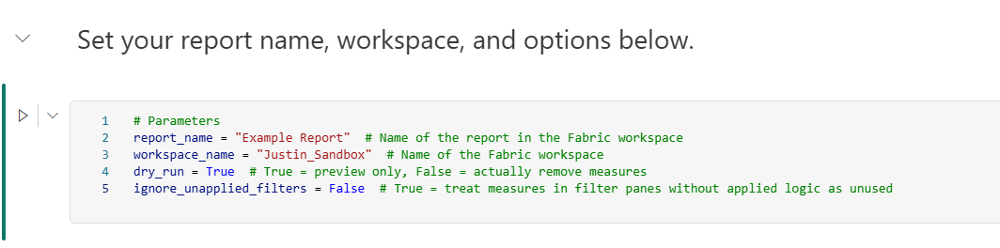
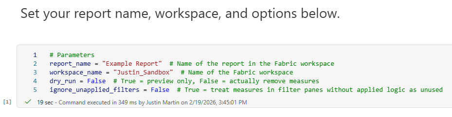
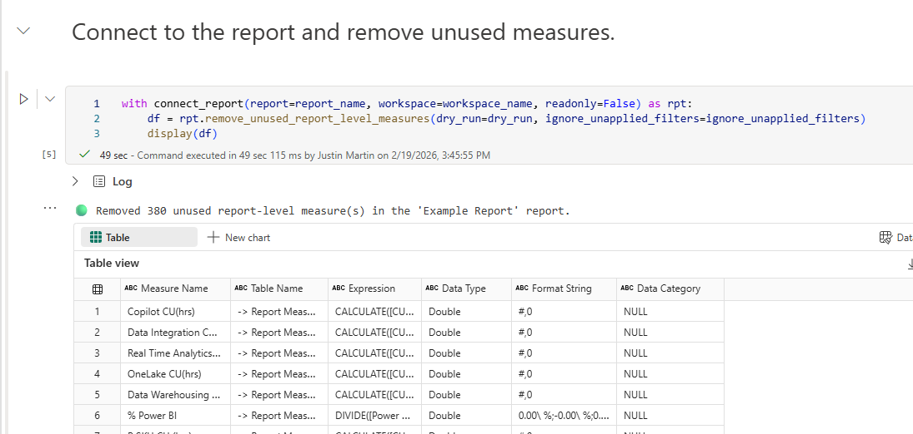
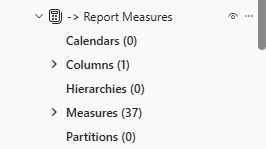

## Introduction

When creating Power BI reports, you often spend a lot of time getting the design, layout, formatting, etc. just right. So when your stakeholders ask you to create a new report, instead of starting from scratch, it is easier to just copy an existing report where you can leverage all of the design work you've done.

From there, it is easy enough to delete unneeded pages and swap out visuals for new ones. But how many of us take the time to figure out which of the report-level measures are still needed and then delete the unneeded ones?

Before you know it, this process of copying old reports with unused measures results in a snowball effect and you are left with hundreds of unused measures in each report, making it difficult to work with.

Our team was guilty of this and we had dozens of reports, each with hundreds of unused report-level measures. 🫣



## The Solution

With the new [PBIR format](https://learn.microsoft.com/en-us/power-bi/developer/projects/projects-report), solving this problem is much easier. Because report definitions are now stored as structured JSON files, we can programmatically scan for measures that are not referenced anywhere in the report and remove them.

I created two tools to handle this, depending on where your report lives:

1. **[Python Script](https://github.com/DAXNoobJustin/daxnoob.blog/blob/main/resources/remove-unused-measures/remove_unused_measures.py)** - For local PBIP projects with PBIR enabled. Run it against your `.Report` folder to find and remove unused measures.
2. **[Fabric Notebook](https://github.com/DAXNoobJustin/daxnoob.blog/blob/main/resources/remove-unused-measures/Remove%20Unused%20Measures.ipynb)** - For reports in the Fabric service. Uses a monkey-patched version of [Semantic Link Labs](https://github.com/microsoft/semantic-link-labs) to connect to a report and clean up unused measures directly.

Both tools work the same way under the hood:

1. Scan the report definition for all report-level measures
2. Check each measure to see if it is referenced in any visual, filter, page, or bookmark
3. Check if any other report-level measure depends on it
4. Remove unreferenced measures iteratively (since removing one measure might make another one unused)

## The Python Script (Local PBIP)

The script runs from the command line and takes a path to your `.Report` folder.

**Dry run** (preview what would be removed):

```bash
python remove_unused_measures.py "path/to/MyReport.Report"
```

**Execute** (actually remove the measures):

```bash
python remove_unused_measures.py "path/to/MyReport.Report" --execute
```

There is also an `--ignore-unapplied-filters` flag. By default, if a measure appears in a filter pane (even if no filter logic has been applied) it is considered "used." With this flag, those measures will be treated as unused.

Here is an example of the dry run output:

```terminal
PS> python remove_unused_measures.py "path/to/Example Report.Report"
🔍 Analyzing report: path/to/Example Report.Report
   Mode: DRY RUN
   Ignore unapplied filters: False
📊 Found 423 report-level measures

🔄 Iteration 1...
   Found 83 unused measure(s)

🔄 Iteration 2...
   Found 10 unused measure(s)

🔄 Iteration 3...
   Found 4 unused measure(s)

🔄 Iteration 4...
   Found 1 unused measure(s)

🔄 Iteration 5...
   Found 2 unused measure(s)

🔄 Iteration 6...
✅ No unused measures found in this iteration

ℹ️  Would remove 100 unused measure(s) in 6 iteration(s):
   - -> Report Measures.EM SKU CU (hrs)
   - -> Report Measures.A SKU CU (hrs)
   - -> Report Measures.Fabric CoreMAU
   - -> Report Measures.Power BI Customer Count
   - -> Report Measures.DE Customer Count
   - -> Data Dictionary.Active Capacity
   - -> Data Dictionary.Premium SKU
   - Fabric Capacity Units.Measure
   - Storage.Kusto Standard Storage (Gb)
   - Capacity Metrics.Scaled Down total
   ... and 90 more

💡 Run with --execute to actually remove these measures.
```

## The Fabric Notebook (Service)

The notebook monkey-patches a `remove_unused_report_level_measures` method onto Semantic Link Labs' `ReportWrapper` class. This lets you connect to any report in the Fabric service and clean up unused measures without downloading anything.



## Example

Let's walk through a real example using the Fabric Notebook.

Here is the report's model view before cleanup with over 300 report-level measures:



And the report view:



First, set the parameters for a dry run to preview what would be removed:



The dry run output shows the unused measures it found:


Once you are satisfied with the results, set `dry_run` to `False` and run again to actually remove them:





Here is the model view after cleanup:


And the report view:



## Conclusion

Thanks to the new PBIR format, removing unused report-measures has become a relatively easy task. I hope you find these scripts helpful and make your report development and maintenance more manageable.

Like always, if you have any questions or feedback, please reach out. I'd love to hear from you!
